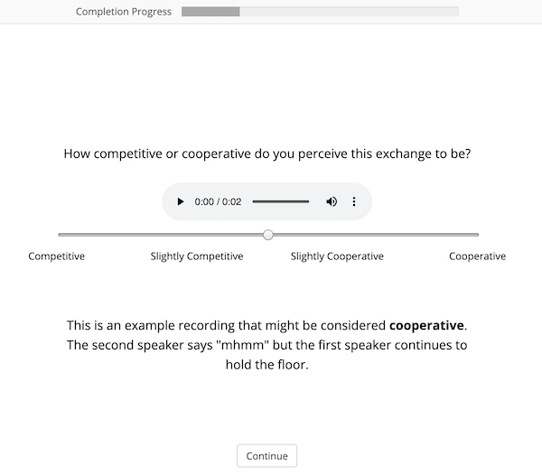

# Pardon the Interruption

Author: Haley Lepp and Gina-Anne Levow, University of Washington Computational Linguistics

## Description:
This study presents a corpus of exchanges between speakers in U.S. Supreme Court Oral Arguments. Each exchange is labeled on a spectrum of 0 ("very competitive") to 100 ("very cooperative") by a human annotator with legal experience in the United States. Details on the collection of these annotations can be found [here](https://digital.lib.washington.edu/researchworks/handle/1773/45514). Our publication at INTERSPEECH is [here](https://www.isca-speech.org/archive/pdfs/interspeech_2020/lepp20_interspeech.pdf) and at NNLP Workshop at KDD is [here](https://sites.google.com/view/nllp/program).

## Instructions:

### Audio:
Download the appropriate oral argument recordings from the website of the [U.S. Supreme Court](https://www.supremecourt.gov/oral_arguments/argument_audio/2019).
Run the audio splicing script using the appropriate recording as an argument. 

`python split_files.py <path to recording> <abbrv. name of argument> <path to corpus file>`

You must have SoX installed. If you prefer another audio processing software, you can extract the turn information from `turns_and_corpus.csv` directly.

### Text:
Transcripts without timestamps are listed publicly on the website of the [U.S. Supreme Court](https://www.supremecourt.gov/oral_arguments/argument_transcript/2019).
This study made use of timestamps extracted from HTML in recordings that have been time-alined by the [Oyez Project](https://www.oyez.org/cases/2019). 
To extract the text by turns:
1. Click on the oral argument recording on the left of the page, which will bring up an animated transcript. 
2. Right click the animation and click "Inspect Element." 
3. Right click on the section marked "class="transcript-section ng-scope"" and select "copy element." This will copy all relevant HTML to the clipboard, and you can save it to a separate document. 
4. I used Beautiful Soup to extract the appropriate information from the HTML. 

### Labels:
Each turn was labeled twice by unique annotators. 

Turns and corpus information are saved in `turns_and_corpus.csv`. The id is the numeric count of the turn in each hearing, the name of the first speaker, the name of the second speaker, and the name of the argument concatenated with underscores. The `start_time` and `end_time` tags record when our turn-change extraction script detected turns. The `length` column is the length of each clip. Before annotating the turn changes, I manually listened to each clip, removing or changing the clips for a variety of reasons. The `removed_from_corpus` includes which clips were removed, the `changed` column includes which were changed, and the `new_name`, `new_start`, and `new_end` columns record what was changed. The `explanation` column gives reasons why changes and removals were made, such as 'MIPTC' (a turn that includes "may it please the court") and 'Audience Laughing'.

Files that are not marked as removed and do not have ratings are those that were not completed within the annotation process. An expansion of the corpus could focus on rating those files.

The columns "r1" and "r2" are the ratings for that clip, and the columns "a1" and "a2" are the ids of individual annotators. The demographic information for those annotators is saved in the file `annotator_demographics.csv`.  `mean_score` records the mean of the scores give by both raters. `text` is the text associated with the turn-change in the html. The column `dash` is a binary column recording whether or not the turn ends in a dash, which can be used as a baseline for classification of competitive turns.

The columns `speaker_1` and `speaker_2` record which speakers participate in a turn. There are also columns for each speaker's gender and role. Genders are binary and based on the public profiles of the speakers; if the corpus is expanded researchers should be cautious not to assume gender, race, or other demographic information about speakers. 

Ratings are raw, as given directly by annotators. For our experiments we binned the labels into quintiles, which capture the peaks in the distribution of reviews and correlate with the set-up of the annotation software that annotators used to label the clips. We used the average label of the two annotators.

The distribution of labels has peaks at the extremes and in the middle. Please note that annotators were instructed to keep the labeling slider tool in the middle if they were unsure of a turn.

Slider which Annotators Used for Labeling

### Audio Features:
Features can be extracted as relevant to individual studies. We had most success with OpenSmile feature-sets.

### General Information about the Corpus
Information about the audio segments and annotations included in the corpus is listed below.

Number of oral arguments: 4 

Number of annotated segments: 732

Number of annotators per segment: 2

Number of unique annotators: 77

Number of segments annotated by each annotator: 1 - 26 (+ 2 “dummy” segments)

Number of Unique Male Participants: 11 including Justice Thomas, who does not speak

Number of Unique Female Participants: 9

Number of Justice to Non-Justice exchanges: 338

Number of Non-Justice to Justice exchanges: 351

Number of Justice to Justice exchanges: 22

Number of Non-Justice to Non-Justice exchanges: 0

Number of Female to Female exchanges: 127

Number of Male to Male exchanges: 269

Number of Female to Male exchanges: 165

Number of Male to Female exchanges: 150
